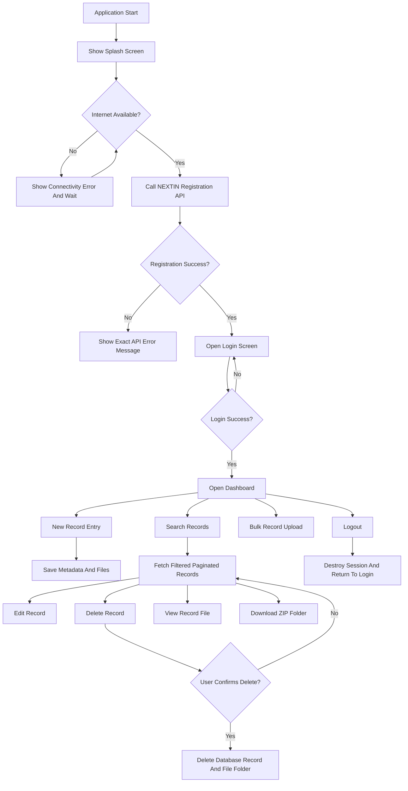

## 1. Product Overview
DAVV Document Management System (Phase-1) is a professional web application for secure record entry, search, viewing, maintenance, download, and deletion of institutional documents.
- It helps DAVV staff maintain a structured digital repository with metadata-driven search, controlled uploads, and complete record lifecycle management.
- The product value is operational efficiency, traceability, and standardized document handling without introducing Phase-2 features.

## 2. Core Features

### 2.1 User Roles
| Role | Registration Method | Core Permissions |
|------|---------------------|------------------|
| Staff User | Login behavior must match the existing DAVV login system at `http://20.33.9.32/` | Access dashboard, create records, search records, edit records, view files, download ZIP, delete records, logout |
| System | Internal application process | Verify registration with NEXTIN API, validate connectivity, auto-generate reference number, maintain audit fields, manage file storage |

### 2.2 Feature Module
1. **Splash Screen**: branding splash, loader, NEXTIN app registration verification, internet connectivity guard, exact API error display
2. **Login Screen**: same login behavior as the existing DAVV login system, no extra authentication methods
3. **Dashboard Screen**: only four actions - New Record Entry, Search Records, Bulk Record Upload, Logout
4. **Add New Record Screen**: metadata entry, searchable dropdowns, date picker, upload area, auto-generated reference number, hidden system fields
5. **Search Records Screen**: metadata filters, reset action, descending sort by date, server-side pagination, actions for edit/delete/view/download
6. **Edit Record Screen**: same as Add New Record with prefilled metadata and loaded uploaded files
7. **View Record File Screen**: record detail summary, file viewer, left-side category/page switching panel
8. **Delete Record Flow**: confirmation dialog, permanent deletion of database record and complete file folder
9. **Download Record Flow**: ZIP generation for single-file and multi-file records using the record folder
10. **Logout Flow**: secure session termination and redirect to login

### 2.3 Page Details
| Page Name | Module Name | Feature description |
|-----------|-------------|---------------------|
| Splash Screen | Loader and startup checks | Show splash UI while verifying internet availability and calling NEXTIN official app registration API |
| Splash Screen | Error handling | If internet is unavailable, block progression and show connectivity error until online; if NEXTIN API fails, show the exact API message without modification |
| Login Screen | Authentication form | Reproduce the same login behavior as `http://20.33.9.32/`; no OTP, SSO, captcha, or alternate methods unless already part of the referenced behavior |
| Dashboard Screen | Action tiles | Show only New Record Entry, Search Records, Bulk Record Upload, and Logout |
| Add New Record | Reference generation | Auto-generate Reference Number from configured business rules; user cannot edit it |
| Add New Record | Metadata fields | Branch searchable dropdown, Subject searchable dropdown, Date picker, Remark input |
| Add New Record | Hidden fields | Logged In Staff ID, Created At, Updated At, Record Status, Total Number Of Pages, Document Type, Document Size, Directory Name are auto-managed and non-editable |
| Add New Record | File upload | Upload document files as per approved prototype, limited to PDF/PNG/JPEG handling defined in backend validation |
| Search Records | Filters | Branch, Subject, Reference Number, Remark Keywords, Date From, Date To with single or combined filtering |
| Search Records | Reset and pagination | Reset clears every filter; backend returns only requested page of results |
| Search Records | Result table | Show Reference Number, Branch, Subject, Date, Record File, Uploaded At, Modified At, Actions |
| Search Records | Sorting | Default descending order based on Date field |
| Search Records | Row actions | Provide Edit and Delete as required, and expose View/Download through record interactions per final UI layout |
| Edit Record | Prefilled form | Load existing metadata and uploaded files for update |
| View Record File | Details and viewer | Render record metadata and a file viewer for record files |
| View Record File | Left category panel | Provide quick switching across pages/files/categories on the left side |
| Delete Confirmation | Confirmation dialog | Ask for confirmation before permanent delete |
| Download Flow | ZIP output | Always download the full record folder as a ZIP, even when the record contains a single file |
| Logout | Session end | Destroy authenticated session and return user to login |

## 3. Core Process
The user launches the application and lands on the splash screen. The system first checks internet connectivity, then verifies the application with the NEXTIN official app registration API. If both succeed, the user proceeds to the login screen. After successful login, the dashboard is shown with only four actions. Staff can create new records, search existing ones with server-side pagination, edit records, view files, download ZIP folders, and permanently delete records after confirmation. Logout always ends the session correctly.

## 4. User Interface Design
### 4.1 Design Style
- Primary colors: institutional navy, clean white, restrained slate gray, success green, error red
- Button style: slightly rounded professional controls with clear hover and disabled states
- Font and sizes: modern readable sans-serif, desktop-first spacing, strong table readability
- Layout style: enterprise admin interface with top bar, clean content containers, clear action hierarchy
- Icon style suggestions: simple line icons for actions, upload, search, edit, delete, download, logout

### 4.2 Page Design Overview
| Page Name | Module Name | UI Elements |
|-----------|-------------|-------------|
| Splash Screen | Branding area | Application logo, favicon-aligned branding, loader, centered status text, error state messaging |
| Login Screen | Login form | Username/password inputs aligned to legacy behavior, submit button, inline validation and server error area |
| Dashboard Screen | Action grid | Four prominent tiles/cards only, consistent icons, clear navigation labels |
| Add New Record | Record form | Structured form layout, searchable dropdowns, date picker, remark field, upload section, save/cancel actions |
| Search Records | Filter panel | Compact filter controls, reset button, search trigger, date range inputs |
| Search Records | Results table | Responsive desktop table, sortable display preset by date descending, row action buttons |
| Edit Record | Record form | Same layout as Add New Record with populated values and existing file list |
| View Record File | Split view | Left-side category/page navigation, record details panel, main file viewer container |
| Delete Confirmation | Modal dialog | Confirmation text, destructive action button, cancel button |

### 4.3 Responsiveness
Desktop-first design is the default. Tablet adaptation should preserve the form and search workflows with stacked sections where required. Mobile support is secondary in Phase-1 but core pages should remain usable without breaking layout integrity.

### 4.4 UI Constraints And Scope Notes
- Only Phase-1 features listed in this document are in scope.
- No Phase-2 workflows, analytics, advanced permissions, notifications, or extra dashboard entries are allowed.
- The Login Screen must mirror the behavior of `http://20.33.9.32/`, and the Add/Edit upload flow must align with the approved prototype once the reference UI is provided.
- The View Record File screen layout will follow the separate UI design when shared, without changing the approved Phase-1 functionality.
