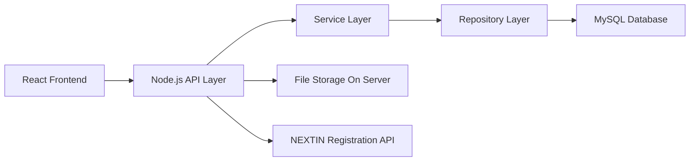
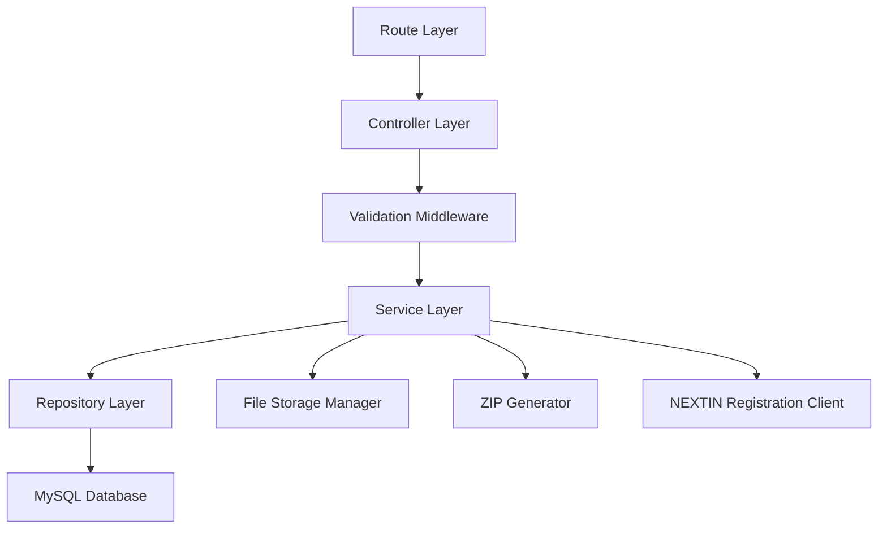
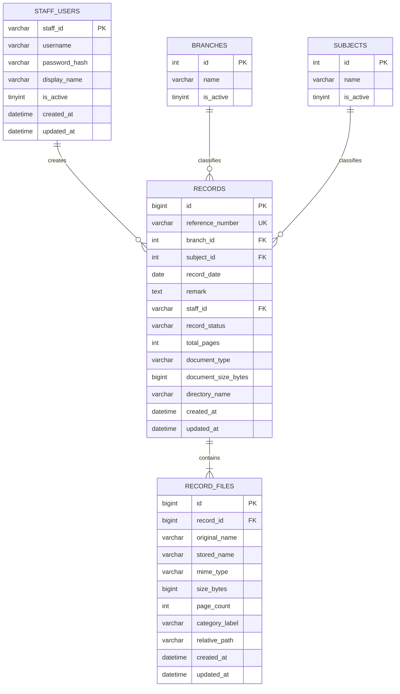

## 1. Architecture Design



The application will use a separated frontend-backend architecture. React handles the user interface, route protection, forms, tables, and file viewer interactions. Node.js exposes secure REST APIs, enforces validation, manages sessions, handles ZIP generation, and coordinates database plus file-system operations. MySQL stores structured metadata and audit fields. Uploaded files are stored in per-record folders on the server and referenced from the database.

## 2. Technology Description
- Frontend: React 18 + Vite + React Router + Axios + Zustand or Context API + form validation library + enterprise UI styling
- Initialization Tool: Vite
- Backend: Node.js + Express 4
- Database: MySQL 8
- Authentication: Session-based authentication matching the existing DAVV login behavior and backend contract
- File Handling: Multer for uploads, Node file-system utilities for folder management, archiver for ZIP download generation
- Validation and Security: Express middleware, schema validation, secure headers, CORS restriction, rate limiting on auth endpoints, server-side filtering and pagination

## 3. Route Definitions
| Route | Purpose |
|-------|---------|
| / | Splash screen entry route |
| /login | Login screen |
| /dashboard | Dashboard with four actions only |
| /records/new | Add New Record screen |
| /records/search | Search Records screen |
| /records/:recordId/edit | Edit Record screen |
| /records/:recordId/view | View Record File screen |

## 4. API Definitions

### 4.1 Authentication And Startup APIs
| Method | Endpoint | Purpose |
|--------|----------|---------|
| GET | /api/app/registration-status | Proxy or validate NEXTIN official app registration API result for splash screen |
| POST | /api/auth/login | Authenticate staff user using the same behavior/contract as the existing DAVV login flow |
| POST | /api/auth/logout | Destroy active session |
| GET | /api/auth/me | Return current authenticated staff session |

### 4.2 Master Data APIs
| Method | Endpoint | Purpose |
|--------|----------|---------|
| GET | /api/branches | Return searchable branch dropdown options |
| GET | /api/subjects | Return searchable subject dropdown options |

### 4.3 Record APIs
| Method | Endpoint | Purpose |
|--------|----------|---------|
| GET | /api/records/reference-number | Generate next reference number based on business rule |
| POST | /api/records | Create new record with metadata and files |
| GET | /api/records | Search records with filters, date descending sort, and server-side pagination |
| GET | /api/records/:recordId | Get one record with metadata and file list |
| PUT | /api/records/:recordId | Update existing record metadata and files |
| DELETE | /api/records/:recordId | Permanently delete record and full folder after confirmation from UI |
| GET | /api/records/:recordId/download | Generate and stream ZIP folder download |
| GET | /api/records/:recordId/viewer | Return viewer-friendly file metadata and page/category structure |

### 4.4 Request And Response Shapes

```ts
type LoginRequest = {
  username: string;
  password: string;
};

type SessionUser = {
  staffId: string;
  username: string;
  displayName: string;
};

type RecordFile = {
  id: number;
  originalName: string;
  storedName: string;
  mimeType: "application/pdf" | "image/png" | "image/jpeg";
  sizeBytes: number;
  relativePath: string;
  pageCount: number | null;
  categoryLabel: string | null;
};

type RecordEntity = {
  id: number;
  referenceNumber: string;
  branchId: number;
  subjectId: number;
  recordDate: string;
  remark: string | null;
  staffId: string;
  recordStatus: string;
  totalPages: number;
  documentType: "PDF" | "PNG" | "JPEG" | "MIXED";
  documentSizeBytes: number;
  directoryName: string;
  createdAt: string;
  updatedAt: string;
  files: RecordFile[];
};

type RecordSearchRequest = {
  branchId?: number;
  subjectId?: number;
  referenceNumber?: string;
  remarkKeywords?: string;
  dateFrom?: string;
  dateTo?: string;
  page: number;
  pageSize: number;
};

type PaginatedRecordSearchResponse = {
  items: Array<{
    id: number;
    referenceNumber: string;
    branchName: string;
    subjectName: string;
    recordDate: string;
    recordFileSummary: string;
    uploadedAt: string;
    modifiedAt: string;
  }>;
  page: number;
  pageSize: number;
  totalItems: number;
  totalPages: number;
  sort: {
    field: "recordDate";
    direction: "desc";
  };
};
```

## 5. Server Architecture Diagram



## 6. Data Model

### 6.1 Data Model Definition



### 6.2 Data Definition Language

```sql
CREATE TABLE staff_users (
  staff_id VARCHAR(50) PRIMARY KEY,
  username VARCHAR(100) NOT NULL UNIQUE,
  password_hash VARCHAR(255) NOT NULL,
  display_name VARCHAR(150) NOT NULL,
  is_active TINYINT(1) NOT NULL DEFAULT 1,
  created_at DATETIME NOT NULL DEFAULT CURRENT_TIMESTAMP,
  updated_at DATETIME NOT NULL DEFAULT CURRENT_TIMESTAMP ON UPDATE CURRENT_TIMESTAMP
);

CREATE TABLE branches (
  id INT PRIMARY KEY AUTO_INCREMENT,
  name VARCHAR(150) NOT NULL UNIQUE,
  is_active TINYINT(1) NOT NULL DEFAULT 1
);

CREATE TABLE subjects (
  id INT PRIMARY KEY AUTO_INCREMENT,
  name VARCHAR(150) NOT NULL UNIQUE,
  is_active TINYINT(1) NOT NULL DEFAULT 1
);

CREATE TABLE records (
  id BIGINT PRIMARY KEY AUTO_INCREMENT,
  reference_number VARCHAR(100) NOT NULL UNIQUE,
  branch_id INT NOT NULL,
  subject_id INT NOT NULL,
  record_date DATE NOT NULL,
  remark TEXT NULL,
  staff_id VARCHAR(50) NOT NULL,
  record_status VARCHAR(50) NOT NULL DEFAULT 'ACTIVE',
  total_pages INT NOT NULL DEFAULT 0,
  document_type VARCHAR(20) NOT NULL,
  document_size_bytes BIGINT NOT NULL DEFAULT 0,
  directory_name VARCHAR(255) NOT NULL UNIQUE,
  created_at DATETIME NOT NULL DEFAULT CURRENT_TIMESTAMP,
  updated_at DATETIME NOT NULL DEFAULT CURRENT_TIMESTAMP ON UPDATE CURRENT_TIMESTAMP,
  CONSTRAINT fk_records_branch FOREIGN KEY (branch_id) REFERENCES branches(id),
  CONSTRAINT fk_records_subject FOREIGN KEY (subject_id) REFERENCES subjects(id),
  CONSTRAINT fk_records_staff FOREIGN KEY (staff_id) REFERENCES staff_users(staff_id)
);

CREATE TABLE record_files (
  id BIGINT PRIMARY KEY AUTO_INCREMENT,
  record_id BIGINT NOT NULL,
  original_name VARCHAR(255) NOT NULL,
  stored_name VARCHAR(255) NOT NULL,
  mime_type VARCHAR(100) NOT NULL,
  size_bytes BIGINT NOT NULL,
  page_count INT NULL,
  category_label VARCHAR(100) NULL,
  relative_path VARCHAR(500) NOT NULL,
  created_at DATETIME NOT NULL DEFAULT CURRENT_TIMESTAMP,
  updated_at DATETIME NOT NULL DEFAULT CURRENT_TIMESTAMP ON UPDATE CURRENT_TIMESTAMP,
  CONSTRAINT fk_record_files_record FOREIGN KEY (record_id) REFERENCES records(id) ON DELETE CASCADE
);

CREATE INDEX idx_records_record_date ON records(record_date DESC);
CREATE INDEX idx_records_branch_id ON records(branch_id);
CREATE INDEX idx_records_subject_id ON records(subject_id);
CREATE INDEX idx_records_reference_number ON records(reference_number);
CREATE FULLTEXT INDEX idx_records_remark ON records(remark);
CREATE INDEX idx_record_files_record_id ON record_files(record_id);
```

## 7. Security And Operational Rules
- Protect all record APIs behind authenticated session middleware.
- Validate file types to PDF, PNG, and JPEG only.
- Enforce upload size limits and reject unsafe filenames.
- Generate storage directory names on the server; never trust client-provided paths.
- Use database transactions for create, update, and delete operations that touch both metadata and files.
- Delete flow must remove the record row and the full directory from storage.
- Search must always be server-side paginated and date-descending by default.
- The splash screen must block app access until both connectivity and NEXTIN registration checks pass.
- API errors from NEXTIN displayed on splash screen must remain unchanged in the UI message body.

## 8. Open Integration Dependencies
- Exact login request/response behavior must be matched against `http://20.33.9.32/` during implementation.
- Add/Edit upload layout must align with the approved prototype once shared.
- View Record File screen UI should follow the separate design reference while preserving the architecture defined here.
